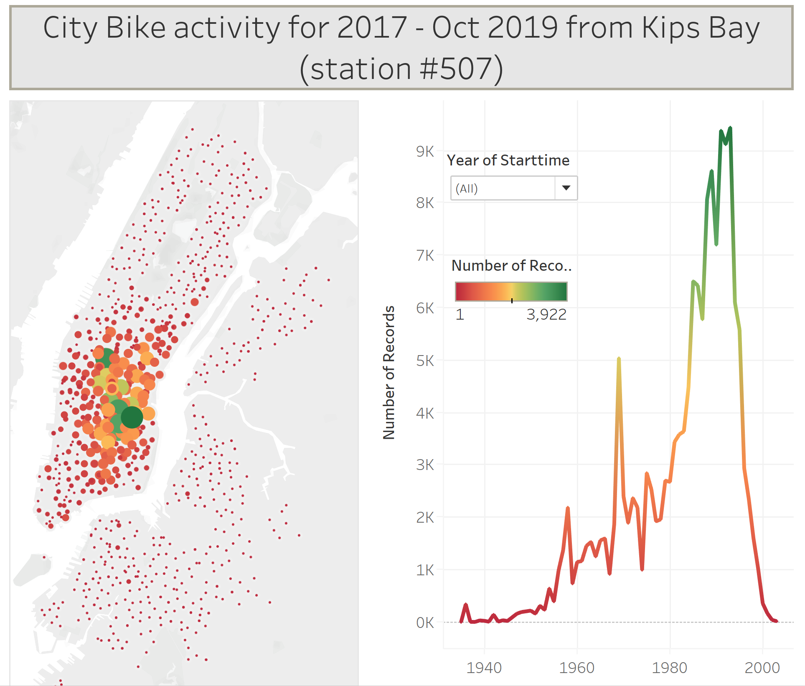
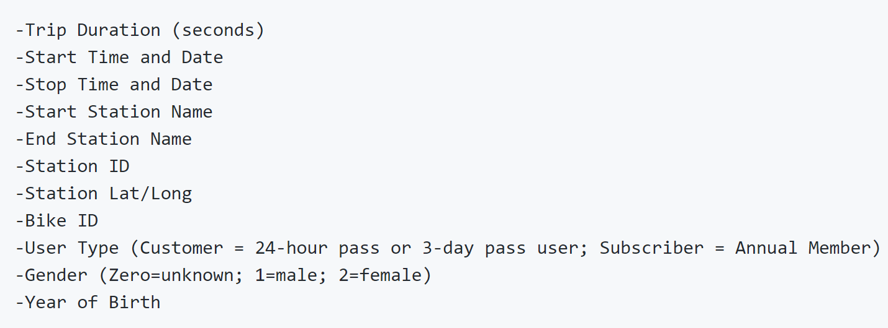

# City-Bike_Tableau

For this assignment we were asked to analyse City Bike sharing program data for New York City.  Due to a high volume of data available I downloaded and normalized data in Jupyter Notebook to oleviate issues with data loading limitations in Tableau and came up with a final database of about 156 tousand of records.

I chose to limit my analysis to the period of Jan 2017 forward and further include only the rides originating in Kips Bay, station nearest to my nome (# 507 - 25th Street & 2 nd Ave).  I also noticed that the datasets showed some record for the riders with birthday in late 19th century, I assumed those were inacurate records and further limited my analysis to the riders with birth year of 1935 or later.

Source data is available at https://www.citibikenyc.com/system-data and includes following componenets:

I have summarized my findings in a number of dashboards and independed visualisaion shown in CityBike_17to19.tbx file and below are my summary nerrative for each of the dashboards presented in the Story -
https://public.tableau.com/profile/allaz#!/vizhome/CityBike_17to19/Story1?publish=yes

# Summary of rides taken from Kips Bay - 
The visualisations on this page show that rides originated in Kips Bay ended mostly in mid-town Manhattan, but a good amount ventured out to Harlem, Bronx and Queens.  Further we see that majorigy of the rides taken were by riders in their mid 20's to mid 30's bracket, with a few spikes for riders in their 50's and 60's.  Finally, the highest ridership month was Sept of 2019 with slightly over 7.5k of rides and the lowest was Mar 2017 with slightly over 2k or rides. Feel free to select individual perion through "Year of Starttime" filter to view visualisation for a single year data only.

# High level summary of rides - 
This dashboard illustrates that while activity by male vs. female riders follows almost identical patter, the number of male riders represents 3/4th of the total polulation.  This correlation is preserved throughout the analysis period.  you can furhter modify "Total rides by gener by month" multiline plot to show data for the selected year.

# Summary of trips by gender - 
In this step I wanted to illustrate correlation of trips taken by male vs. female riders in terms of miles as demonstrated by month trip taken vs. birthyear of the rider.  This dashboard also offers by year filter for additional views of the summarized output.  As we can see overall male riders drove about three time as far as female riders.  However, when viewed on by birth year basis this discrepancy shrincs substantially especially for riders born aroudn 1990, male riders went only twice as far as female riders.

# Summary of rides by user-type - 
This set of visualizations shows that while subsrcibers reprecent just about 99% of the total riders, gender proportion is consistent of overall allocation 1 to 3 for females vs. males.  Interestengly, it shows that with slight variation in preference both guest customers and regular subscriber favor May - October for thier bike excursions.  Please use rider-type filter to gain more detail on this point.

# Growth in Ridership and top 10 end stations - 
The line chart on this page show that the ridership has been moderatly but continuously growing with a consistent pattern of high popularity during the warmer times of the year.  In addition, this page shows top 10 stations overall, as well as, top 10 for summer and winter.  Interstingly enough, there is very small variation in the popular destinations between winter and summer.
